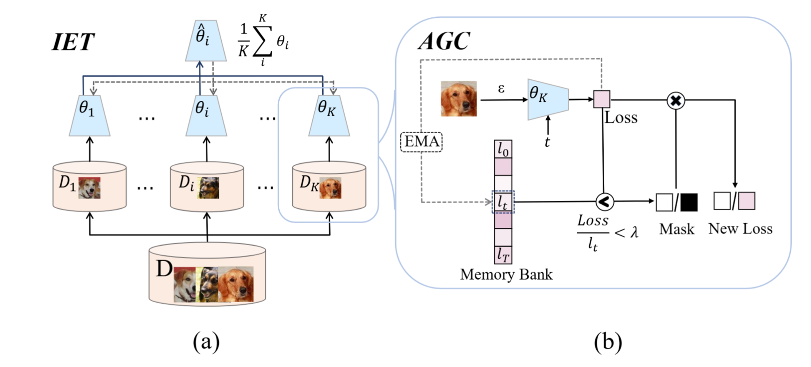

# Iterative Ensemble Training with Anti-Gradient Control for Mitigating Memorization in Diffusion Models
This is the implementation(unconditional generation) of Iterative Ensemble Training with Anti-Gradient Control for Mitigating Memorization in Diffusion Models (ECCV2024).

Xiao Liu* , Xiaoliu Guan* , Yu Wu† , and Jiaxu Miao†

[Paper](https://link.springer.com/chapter/10.1007/978-3-031-73021-4_7)
[arxiv](https://arxiv.org/abs/2407.15328)

Text-conditioned implementation is [here](https://github.com/liuxiao-guan/IET-AGC_SD)

## 1. Introduction
We investigate the memorization phenomenon in the diffusion generative model through the lens of the loss.
We propose a novel training framework, Iterative Ensemble Training with Anti-Gradient Control (IET-AGC) to mitigate memorization in diffusion models.



## 2. Environment Setup
Install conda environment
```sh
conda env create -f env.yml
conda activate fedes
```
We use RTX-4090 machines to train the models.

## 3. Dataset
 We evaluate our method on CIFAR-10, CIFAR-100, AFHQ-DOG for unconditional generation. 
 <!-- and LAION-10k for text-conditioned generation. -->

 ### CIFAR-10 and CIFAR-100 
 You can download from [here](https://www.cs.toronto.edu/~kriz/cifar.html), and choose the python version.

 ### AFHQ-DOG
 You can download from [here](https://github.com/clovaai/stargan-v2). You can only choose the Dog subset.

<!-- ### LAION-10k
Download the LAION-10k split [here](https://drive.google.com/drive/folders/1TT1x1yT2B-mZNXuQPg7gqAhxN_fWCD__?usp=sharing) from [somepago](https://github.com/somepago/DCR). -->

## 4. Training and evaluate 
Note: Before you run, you must change the paths which include the path of log, generate, datasets and so on. 

#### Default Training 

```sh
bash com/default.sh 
```
#### Our Method 
```sh
bash com/com_c10_v.sh 
```

+ ```main.py``` and ```main_fed.py```, the training files. The default setting is for CIFAR-10 dataset. We used one RTX-4090 GPU to train for almost one day.
+ ``` all_in.py``` the evaluate file, includes three parts: generate images, caculate the metric(MQ and FID), and make grid for visualization.

## 6. Citing
```
@inproceedings{liu2025iterative,
  title={Iterative ensemble training with anti-gradient control for mitigating memorization in diffusion models},
  author={Liu, Xiao and Guan, Xiaoliu and Wu, Yu and Miao, Jiaxu},
  booktitle={European Conference on Computer Vision},
  pages={108--123},
  year={2025},
  organization={Springer}
}
```
## 7. Acknowledgement
We would like to thank this [project](https://github.com/w86763777/pytorch-ddpm) generously sharing their code, from which our code is adapted.
